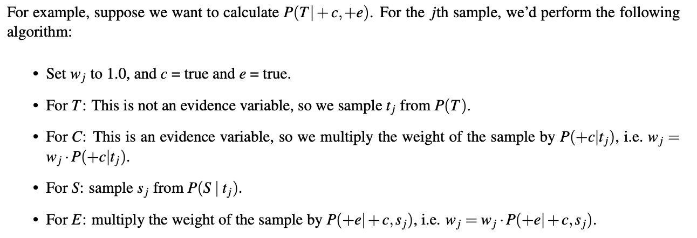
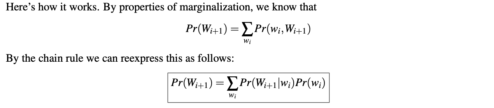

  Simplified notes from the course website.

## Note 1

Given the environment, we can write a rational planning agent and a search problem. We need:

* State space: e.g. all *(x,y)* tuples for pacman 
* Successor function: pacman can go NSEW
* Start state: position of all entities
* Goal test: whether all food pellets have been eaten

Search problems can be represented in memory as **state space graphs** or **search trees**. The first is usually too big, but represents each state only once. The second has no restriction on the number of times a state can appear, and paths through it can encode a plan or policy. 

Searching through a tree can be written with the following general algorithm:

We can modify the general uninformed tree search algorithm to yield DFS, BFS, UCS, and incorporate heuristics to make A*. We generally keep in mind the following properties of search strategies:

* **Completeness**: will find the solution if it exists
* **Optimality**: will find the lowest cost solution 
* **Branching factor**: number of nodes placed on the fringe each time a node dequeued. Depth *k* search tree has $O(b^k)$ nodes
* Maximum depth *m*
* Depth of shallowest solution *s*

DFS:
* Always select the deepest fringe node
* Uses a LIFO stack
* Not complete: cycles and/or infinite depth trees will never have a solution
* Not optimal: will always find the "leftmost" solution with no regard of costs
* Time complexity: will search the entire tree in the worst case: $O(b^m)$
* Space complexity: fringe will store maximum of $O(bm)$ nodes

BFS:
* Always select the shallowest fringe node
* Use a FIFO queue
* Complete: if solution exists and *s* finite
* Not optimal: does not consider costs, but if all edges equivalent, then optimal (reduction to UCS)
* Time complexity: will explore all nodes at depth until solution depth: $O(b^s)$
* Space complexity: will store nodes at depth of the shallowest solution: $O(b^s)$

UCS:
* Always select the lowest cost fringe node
* Use a priority queue on the cost from the start to the new node
* Complete: if solution exists and *s* is finite
* Optimal: if all edges are nonnegative
* Time complexity: if optimal path cost $C^*$ and minimal cost between nodes in the state space graph $\epsilon$, then need to explore all nodes in depths ranging from 1 to $C^*/\epsilon$, so running time complexity of $O(b^{C^*/\epsilon})$
* Space complexity: will store nodes at level of cheapest solution:$O(b^{C^*/\epsilon})$

Greedy search:
* Always select the lowest heuristic cost node
* Use a priority queue on heuristic cost
* Completeness and optimality: depending on heuristic

A* search:
* Always select the lowest estimated total cost node (heuristic and lowest cost)
* Use a priority queue on backward (sum of edge weights) and forward (heuristic) cost
* Complete and optimal: given appropriate heuristic 
* High speed of greedy search and optimality/completness of UCS

Admissibility:
* Required for optimality of A* 
* $\forall n, 0 \leq h(n) \leq h^*(n)$, meaning heuristic is never negative or overestimate 

Consistency:
* Resured for optimality and *consistency* of A*
* $\forall A,C, h(A) - h(C) \leq cost(A,C)$, meaning that the heuristic should not only underestimate the total distance to the goal from any node, but should also underestimate the cost of each edge in the graph.
* Consistency implies admissibility

Dominance:
* if the estimated goal distance for a heuristic is greater than that of another heuristic for every node in the state space graph
* trivial heuristic is 0 for every edge, reducing A* to UCS
* gives rise to heuristic semi-lattice
  

## Note 2

Minimax:
* opponent behaves optimally
* values of non-terminal states depends on values of terminal states

Alpha-Beta pruning:
* if no more data can be provided
* does not affect eventual outcome, but may affect values of intermediary nodes

Evaluation functions:
* take in current state and output estimate of true minimax
* not feasible to search until the bottom of search trees (games too big)
* used in **depth-limited minimax**
* linear combination of **features**, with weights

Expectimax:
* represent randomness, esp when not assuming opponent is optimal
* can also still prune
  
## Note 3

**Nondeterministic search problems** can be modeled with **Markov decision processes (MDPs)**

* set of states *S*
* set of actions *A*
* start state
* one or more terminal states
* **discount factor** $\gamma$ for finite horizon purposes
* transition function $T(s, a, s')$ that gives probability of taking a certain action from a state and going to a new state
* reward function $R(s, a, s')$ that rewards agent's survival and also arrival at terminal state
  * can be punishments as well (negative)

MDPs, like state-space graphs, can be unraveled into search trees. Uncertainty (e.g. by the transition function) is modeled by **q-states**, which are identical to expectimax chance nodes. The utility is then the the max over the q-states.

Bellman equation:

* dynamic programming equation, given inherent recursive structure

Value iteration:
* running time is $O(\|S\|^2\|A\|)$ since need to update values of all $\|S\|$ states for all $\|A\|$ possible actions
  * Then another $\|S\|$ when extracting the policy, which requires iteration over all the states again
  

Policy extraction:
* Note: better to keep list of q-values in practice, so don't have to recompute on the fly when extracting policy

Policy iteration:

## Note 6

We can find any desired probability distribution $P(Q_1 \cdots Q_k \| e_1 \cdots e_k)$ using **inference by enumeration**
* **Query variables**: unknown and appear on the left side of the distribution
* **Evidence variables**: observed, whose values appear on the right side of the distribution
* **Hidden variables**: don't appear in the dist to be calculated, but show up in the overall joint distribution

Bayes nets:
* DAG that captures relationships between variables
* Local probability tables and DAG have enough information to compute any probability distribution that could have otherwise been computed from the entire joint distribution
* Each node represents conditional probability table that is stored, and is conditioned on its parents
  * *Each node is conditionally independent of all its ancestor nodes in the graph, given all of its parents*
  
**Inference**: to calculate the joint PDF for a set of query variables based on some set observed variables. (e.g. goal of Bayes nets really). We can either create and iterate over an exponentially large table (bad) or we can eliminate variables one by one (ok for the most part). 

**Elimination** of variable $X$: 
1. Join (multiply) all factors involving $X$. Factor is an unnormalized probability, meaning that we need to normalize afterwards
2. Sum out $X$

Instead of inference, we could also just implicitly calculate the probabilities for our query by counting samples. Naturally, this is called **sampling**. 

**Prior sampling**
* just keep generating samples until evidence variables are consistent
* downside is that you have to throw away a lot of samples

**Rejection sampling**
* just like prior sampling, except as soon as a sample is inconsistent with evidence, throw it out

Prior sampling and rejection sampling both work because valid samples occur with the same probability as specified in the joint PDF. 

**Likelihood weighting**
* assume we never generate a bad sample
* manually set all variables equal to the evidence, but weight so that it still follows the joint PDF 
* this normalizes the probabilities 

## Note 8

**Markov models** serve pretty much the same purposes of infinite-length Bayes' nets. We can track the initial distribution at $t=0$ and the transition model that dictates probabilities of state transition between timesteps. The **Markov property**, aka **memoryless property**, means that the state at timestep $i+1$ only relies on the timestep $i$. This can be the case for $i+k$ where $k$ is any positive integer actually, but then we can reduce down to the Markov property. 

Joint distributions in a Markov chain can be calculated using the chain rule and also taking into account the Markov property to eliminate conditional terms. To calculate the distribution on some timestep, we could sum out all variables, but that's pretty inefficient. 

The **min-forward algorithm** can calculate that more efficiently:

We can then solve for the stationary distribution if we want by setting the distributions for $t$ equal to that of $t+1$, and solving the resulting system of equations.

**Hidden Markov models** are the same as regular Markov models but have both state variables and evidence variables. Combining the two we can get belief distributions such that $B(W_i) = Pr(W_i\| f_1, \cdots f_i)$ and similarly $B'(W_i) = Pr(W_i\| f_1, \cdots f_{i-1})$, where the difference is that time has not elapsed yet in the second distribution. This is important in the next algorithm: 

The **forward algorithm** is the HMM analog of the mini-forward algorithm:

It consists of a **time elapse update**, where we advance time by one timestamp and calculate $B'(W_{i+1})$ from $B(W_i)$ by marginalization, and then incorporate new evidence from that timestep and calculate $B(W_{i+1})$ from $B'(W_{i+1})$ in the **observation update**.

## References
1. Course notes from [CS188 Spring 2019](https://inst.eecs.berkeley.edu/~cs188/sp19/)