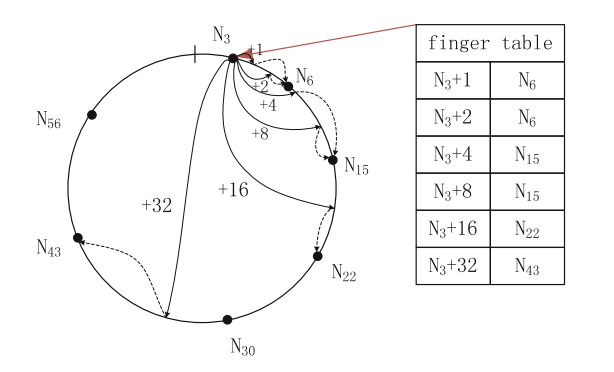
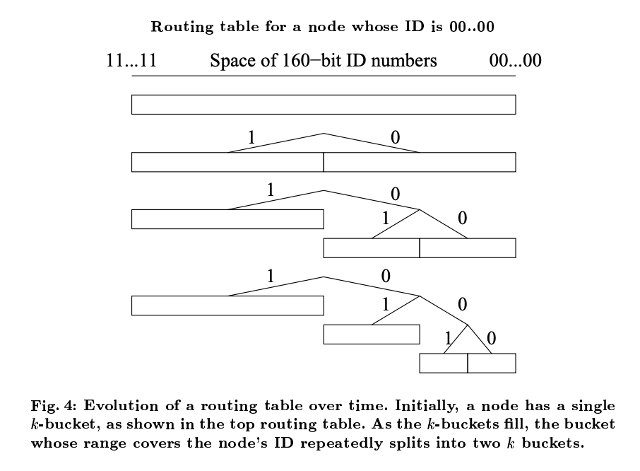
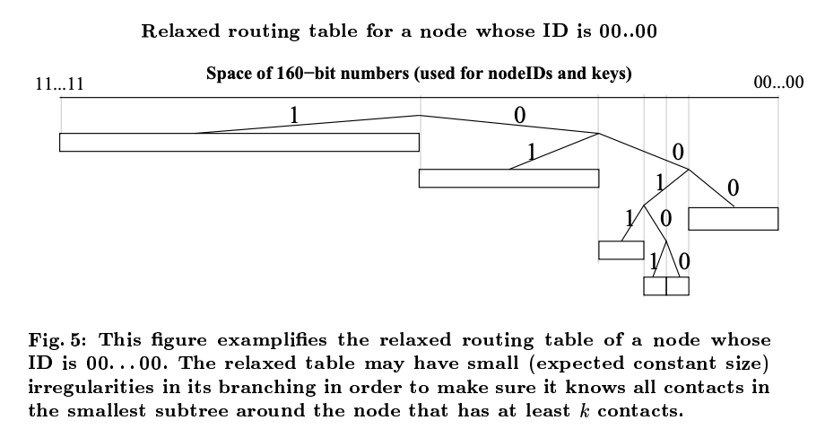

  Just some notes on various DHT papers and various other resources. Very messy. 

  DHT usage in the blockchain space at this point in time is mainly found in node discovery (dialing) subroutine. The aim of this preliminary research is to gain intuition in the advantages and disadvantages of historical DHT architectures, especially in their usage in blockchains (e.g. Ethereum using Kademlia). Next step is to then gain an intuition in building next generation BFT DHT architectures.

# Chord

A particularly special paper since it was written by professor Ion Stoica. Also one of the first p2p systems to be published by academia. Chord addresses load balancing, fault tolerance, efficiency of lookups and inserts, and also of data locality.  

* Chord scales logarithmically in state and communication costs as the number of nodes increases. 
* Uses consistent hashing to determine node ID, and enables ring structure visualization
* Nodes know clockwise successors, using finger table
* In finger table, where for keyspace of size $2^m$, the $i$th entry in the finger table for node ID $n$ has the value of the first node ID such that $id \geq n + 2^i \mod{2^m}$

{: .center-image }

* Files are stored in the same way nodes are allocated in the ring e.g. hash of file name 
* Files are identified by the hash of their filename, and are stored at the first peer it maps to (e.g. first peer immediately to the right of the keyspace.)

### Advantages

Chord emphasized the frequency of node arrivals and departures. Nodes going offline, troubled connection, etc are all concerns that modern distributed systems should consider. At a more general level, Byzantine fault tolerance may also be considered, but that was not the focus of Chord. 

Chord was not designed to anonymous, and thus assigns responsibility for documents to specific Chord nodes. This allows Chord to guarantee **predictable lookup times**.

### Disadvantages

Chord is **not anonymous by design**, which means that by its default formulation, is not compatible with anonymity focused public distributed systems of today (e.g. public blockchains).

Node IDs in Chord are calculated by hashing the node's IP address, and this would be easy to spoof and to **Sybil attack**. Similarly, keys in Chord are not content addressed but rather constructed by hashing the file name. This can be easily spoofed, especially when considering that only one version of the file for each file name can be stored at a time. It may also be the case that if a node is designated to store a file $x$, it may serve any verion of $x$ or even change $x$ arbitrarily. While there is decentralization in terms of topology, nodes are not able to host their own files, and instead depend on a peer, or set of peers (depending on replication parameters), to host their file for them.

Chord lookups are considered slow when consider to newer DHTs such as Kademlia, due to the lack of async RPCs when querying for nodes or other data. 

_______________________________

# Kademlia

Kademlia is a distributed hash table primarily used for decentralized p2p networks. It exists on the application layer and is built off of UDP, which Kademila nodes use to communicate amongst themselves. Each node is assigned a 160 bit node ID in onboarding process that is used for identification and also routing between nearby nodes based on an XOR prefix distance metric. 

The need for XOR (or any other symmetric metric) is apparent when considering propagation of important information. When a node receives a query from another node, the node can learn useful and hopefully up-to-date routing information from the query. This follows in the design principle of soft state, as we'll see later in discussion of node liveness and $k$-buckets.

Each node can be organized into a leaf in a binary tree for visualization purposes. And XOR can be visualized as the number of subtrees away two node IDs are.

* Kademlia's XOR metric is **unidirectional** as Chord's clockwise circle metric is, meaning that for any node ID and a given distance from it, there is only one other node ID that satisfies the XOR distance metric. This makes all queries converge along the same path.
* Like Pastry and unlike Chord, the XOR metric is also **symmetric**. This means that the peers of any node will likely be maintaining the same information a node maintains (or at least within similar address space). Symmetry in Kademlia prevents the clockwise limitation of Chord, and instead allows for both clockwise and counterclockwise movement. 

Nodes store a lists of triples (called $k$-buckets) of <IP addr, UDP port, Node ID> for nodes of varying distances. $k$-buckets implement LRU eviction policy except that it only evicts nodes that fail to respond to a ping message. 

**Recursive node lookup**
* node looks locally at $\alpha$ triples that are closest to the target ID. $\alpha$ is a local concurrency parameter, and defines number of parallel async requests to be sent. 
* nodes respond with triples, and new parallel requests are made
* nodes that do not respond in time are no longer considered
  
Recursive value lookup is similar to recursive node lookup except it may return early when encountering cached data in on-path nodes.

The structure of the Kademlia routing table is such that nodes maintain detailed knowledge of the address space closest to them, and exponentially decreasing knowledge of more distant address space.

In organizing the node ID space, Kademlia takes care to avoid overly imbalanced trees such as the one in the image below. k-buckets are allocated by demand, such that whenever a node ID is to be added to the routing table, a new k-bucket will be created with half the original key space if the k-bucket is full.

To solve issue of imbalance, Kademlia relaxes the routing table and allows irregularities in branching. This saves space. 

### Advantages

Kademila primarily provides a decentralized lookup service. Being decentralized increases its resistance to DoS attacks. In the event of node outages, Kademila has processes by which it can recover using soft state. $k$-bucket LRU eviction policy avoids evicting live nodes, and can thus avoid the case of DoS flushing the node's routing state. However it seems like DoS is still possible by filling a node's message queue. 

Kademlia's parallel recursive node lookup can have lower latency since it can choose from $k$ nodes in a $k$-bucket to satisfy the $\alpha$ replication parameter. Note that when $\alpha = 1$, then the routing algorithm resembles that of Chord. 

Since the routing metric is unidirectional, it is likely that future calls to the same target key will receive a cached copy of data.

By being symmetric, the XOR distance metric allows simple network analysis and thereby allows nodes to learn about the network simply by participating in it passively. Usage of XOR also prevents the need for many concurrent routing algorithms, so Kademlia in this way is faster to implement and debug. 

### Disadvantages

Kademila's XOR metric for defining network toplogy is artificial and does not consider actual geographic network toplogy as do cluster based decentralized storage systems such as Cassandra and RADOS. This is by design, as to dissociate geographical and logical decentralization. This leads to performance hits as the system scales out, though is the price to pay for decentralization. In general, aggregation is difficult to achieve in decentralized systems.

Kademila was not designed at the time to be completely fault tolerant to the extent of modern day public blockchain systems being Byzantine fault tolerant. Nodes rely on RPC call to neighboring nodes to fetch the $k$ nodes closest to a target node. Malicuous neighboring nodes could return invalid triples, and by default, nodes take action on the first response from the $\alpha$ peers rather than achieving some threshold consensus.

There is a requirement that the original publisher of a key/value republish it every 24 hours. This seems like an arbitrary assignment, and in certain cases, would hurt the replication of such file. Problem like this could be addressed by not storing the data of files themselves on the DHT, but rather information about where to fetch files (e.g. in Coral).

Kademlia is vulnerable to Sybil attacks, since node ID is generated randomly. Introducing proof-of-work such as in S/Kademlia addresses the issue by ensuring nodes pay compute to create a node ID. 

Nodes are responsible for caching and serving files directly in Kademlia. This means that data can be unnecessarily replicated many times on "closer" nodes, while the data may exist in a "further" node (e.g. by XOR). Other DHTs such as Coral address this issue by opting to only transmit metadata on DHT such that the DHT only stores information about the addresses where certain data can be found, and not the data itself. 

### References

1. [Chord: A Scalable Peer-to-peer Lookup Service for Internet Applications](http://nms.csail.mit.edu/papers/chord.pdf)
2. [Kademlia: A Peer-topeer Information System Based on the XOR Metric](https://pdos.csail.mit.edu/~petar/papers/maymounkov-kademlia-lncs.pdf)