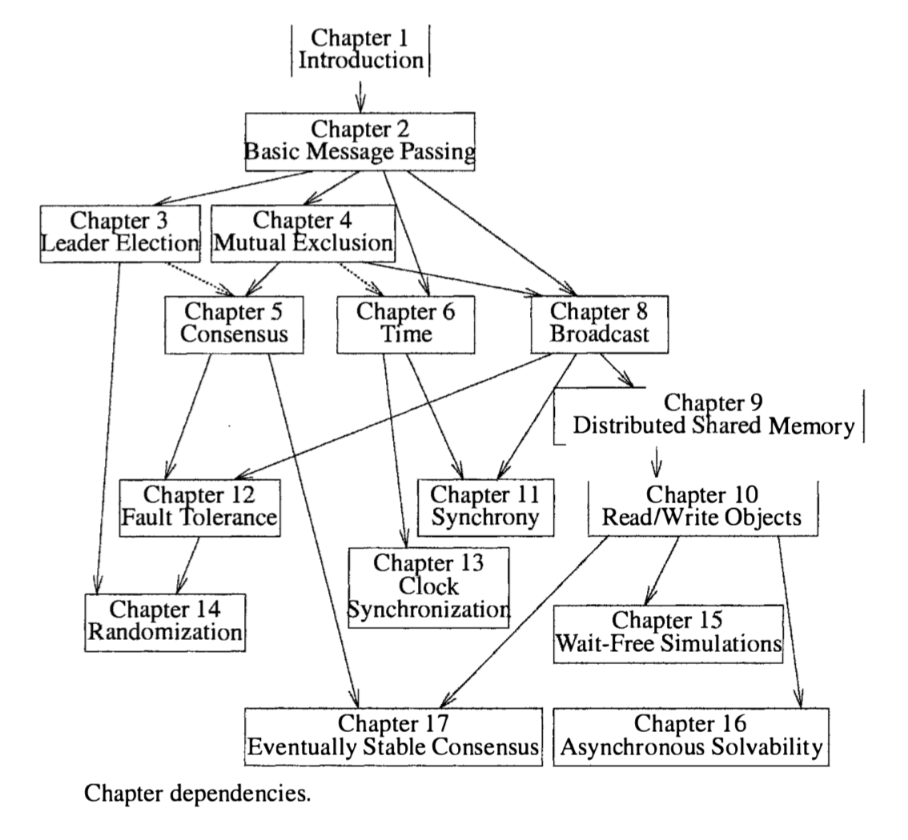
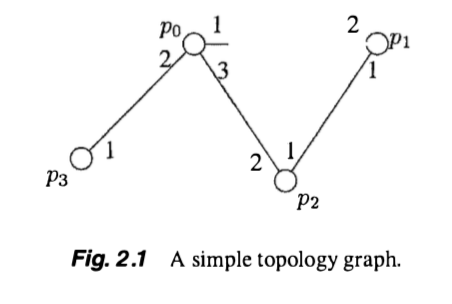

<p class="message">
  My notes reading through the Attiya, Welch Distributed Computing book. Also seems like MathJax isn't working for some sections remotely; will look into this in the future...
</p>

# A guiding architecture



My main interest is to study consensus, but we'll see where that takes me.

# Motivation

Despite this book being nearly 14 years old, I do believe in the foresight of traditional literature. What was discovered and understood in the past can provide insight in deciphering current day issues. Such is definitely true in the case of distributed systems. My main motivation for studying distributed systems and its related technologies (networks, database systems, etc.) has come to be through my initial exposure to blockchain. The recent move towards academia and formally proving the properties of large scale public blockchains (underlying consensus and Sybil control stacks) due to more university involvement has served as my motivation as I dive deep into the traditional academic literature that underlies the space.

# Introduction

The goal of parallel processing: employ all processors to prerform one large task. Processors may be on the same chip or local-area cluster of workstations, to the Internet.

A means to share resources: e.g. printer at home or in the office. 

Lack of adherence to standards, heterogeneous hardware and software.

Three facctors/fundamental difficulties:
* Asynchrony
* Limited local knowledge
* Failures

## Distributed Computing

Framework for specifying algorithms and comparing their performance: for distributed systems. Identify fundamental problems in distributed systems, state them precicely, and design and analyze efficient algorithms to solve them. Prove optimality.

No only time and (local) space:
* Communication costs
    * number of messages 
    * size and number of shared variables
* Numer of faulty vs nonfaulty components

Increased scope for "negative" results, lower bounds, and impossibility results (scary!). Like showing that something is NP-complete.

Maneuverability in distributed systems: we can change the rules. e.g. posing slightly weaker problem statement or to build stronger guarantees into system.

Essence of distributed systems paradigm (since the 1970s) has been caring about computability issues rather than complexity issues.

## Theory to practice


Earliest example of dist system: operating system time-sharing a single CPU. Virtual concurrency: mutual exclusion, deadlock detection and prevention.

MIMD with shared memory (tightly coupled) are called multiprocessors -- multiple separate hardware running common software. Connected by bus or switching network. MIMD can also be loosely coupled and not have shared memory e.g. workstations on LAN.

Looser: autonomous hosts connected by network: Internet, LAN. Separate hardware running separate software, though entities interact through well-defined interfaces (Internet stack).

Above ordered: 
* Synchronous message-passing: idealization; some timing information known, such as upper bounds on message delay
* Asynchronous shared memory: tightly-coupled machines; processors do not get their clock signal from a single source
* Asynchrnous message-passing: loosely-coupled machines and WAN

*******compare with PoS synchrony article ************


# Basic algorithms in message-passing systems

Two main timing models: synchrnous, asynchronous

Main complexity measures: number of messages and time

Simple algorithms: boradcast/collect information, construct spanning trees

## Formal models 

### Systems

System or algorithm consists of n processors



Processors:
* Processors connected by (bi)directional channels. 
* Can be modeled as a (possibly infinite) state machine
* 2r special components, if $r := degree$. $inbuf_i[l]$ and $outbuf_i[l]$ for every $1 \leq l \leq r$.
* Internal state is anything other than $outbuf$, and transition function uses internal state as input

Configuration is a vector of states of all processors. State of all processos' $outbuf$s are current messages in transit. 

Events:
* computation event $comp(i)$, using processor $p_i$'s internal state
* delivery event $del(i,j,m)$, delibery of message $m$ from $p_i$ to $p_j$

Conditions:
* safety condition: condition that must hold in every finite prefix of the sequence. e.g. every step by processor $p_i$ immediately follows a step by processor $p_0$. Informally, nothing bad has happened yet. e.g. step by $p_i$ never immediately follows a step by any processor other than $p_0$
* liveness condition: condition that must hold a certain number of times (possibly infinite). e.g. eventually $p_1$ terminates means that it terminates once. $p_1$ takes an infinite number of steps requires taking 1 step an infinite number of times. Informally, eventually something good happens.

Any sequence satisfying all safety conditions is an *execution* and any sequence satisfying also all liveness conditions is *admissible*

#### Asynchronous systems

Asynchronous algorithm: algorithm independent of any particular timing parameters e.g. no upper bound on timing.

An execution segment $\alpha$:

$$C_0, \phi_1, C_1, \phi_2, C_2, \phi_3 \cdots$$

If eexecution segment finite, then:
*  If $\phi_k = del(i,j,m)$ then $m$ must be element of $outbuf_i[l]$ in $C_{k-1}$, where $l$ is $p_i$'s label for channel $\{p_i, p_j\}$. The change is message $m$ is removed from src outbuf, and placed in dst inbuf. 
*  If $\phi_k = comp(i)$ then state transition for $p_i$ based on accessible state in $C_{k-1}$, and message also sent out at this event. **Processor's transition function guarantees that the $inbuf$ variables are emptied**

For each execution segment, associate a schedule: sequence of events in the execution. Not every sequence of events is a schedule for every initial configuration: e.g. messages not valid in certain configurations.

$exec(C_0, \sigma)$ starts with initial configuration and also schedule segment.

Execution *admissible* if each processor has an infinite number of computation events and every message sent is eventually delivered. Infinite computation events models processors do not fail, not that there is infinite loop. "Termination" (informal notion) can mean that transition function does not change the processor's state e.g. takes dummy steps. Schedule *admissible* if it is the schedule of an admissible execution.

#### Synchronous systems

Lockstep:
* Execution partitioned in rounds
* Each round, every processor can send a message to each neighbor. Empty $outbuf$
* Then, processors compute based on messages received

Lockstep generally not achievable in practical distributed systems, but convenient.

Once algo designed for ideal timing model, can be automatically simulated to work in other more realistic timing models.

Execution *admissible* if it is infinite. Due to round structure: every process takes an infinite number computation steps, and every message sent is eventually delivered. 


```
In a synchronous system with no failures, once the algorithm is fixed, the only relevant aspect of executions that can differ is the initial configuration. In an asynchronous system, there can be many different executions of the same algorithm, even with the same initial configuration and no failures, because the interleaving of processor steps and message delays are not fixed.
```

### Complexity measures

Number of messages and amount of time.

Termination: when all processors are in terminated states and no messages are in transit. Admissible execution is still infinite, but every processor making dummy steps.

Message complexity: maximum of the total number of messages sent, over all admissible executions of the algorithm

TIme complexity:
* Synchrnonous: maximum number of rounds in any admissible execution of the algorithm until the algorithm has terminted
* Asynchronous: assume maximum message delay in any execution is 1 unit of time 
    * Timed execution: execution that has nonnegative real numbers associated with each event (time at which the event occurs)
        * Time starts at 0 and is nondecreasing, must be strictly increasing for each individual processor, and must increase without bound if the execution is infinite
    * Delay: time that elapses between computation event that sends the message and the computation event that processes the message
        * Time message waits in sender  $outbuf$ and recipient $inbuf$
    *  


