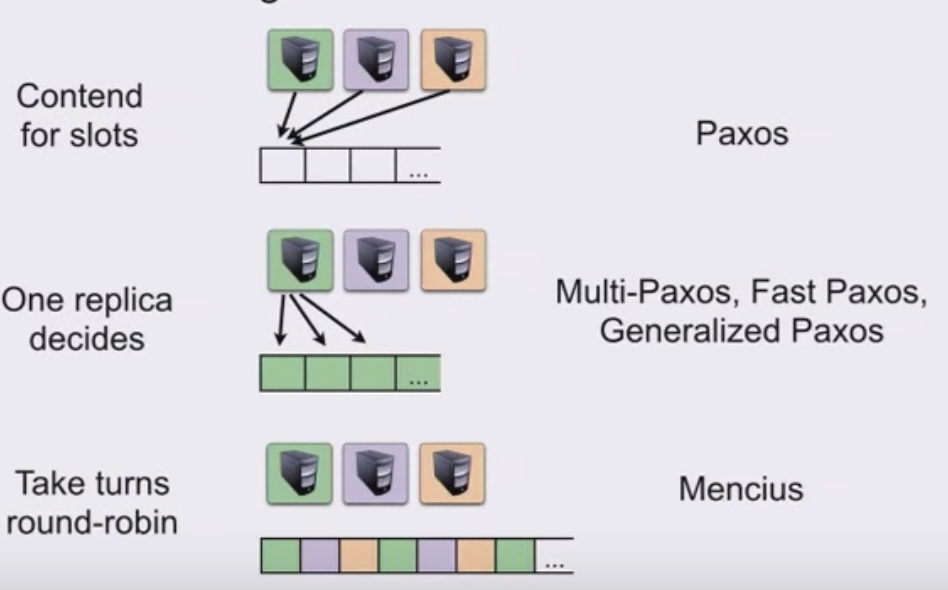
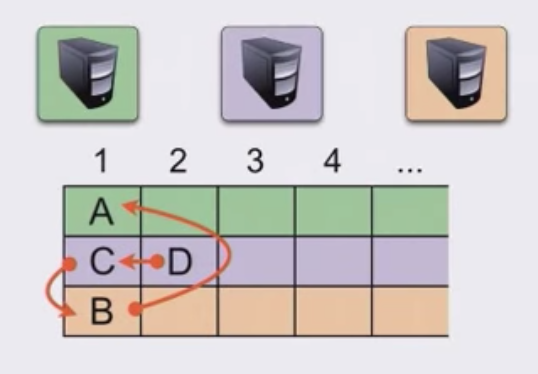
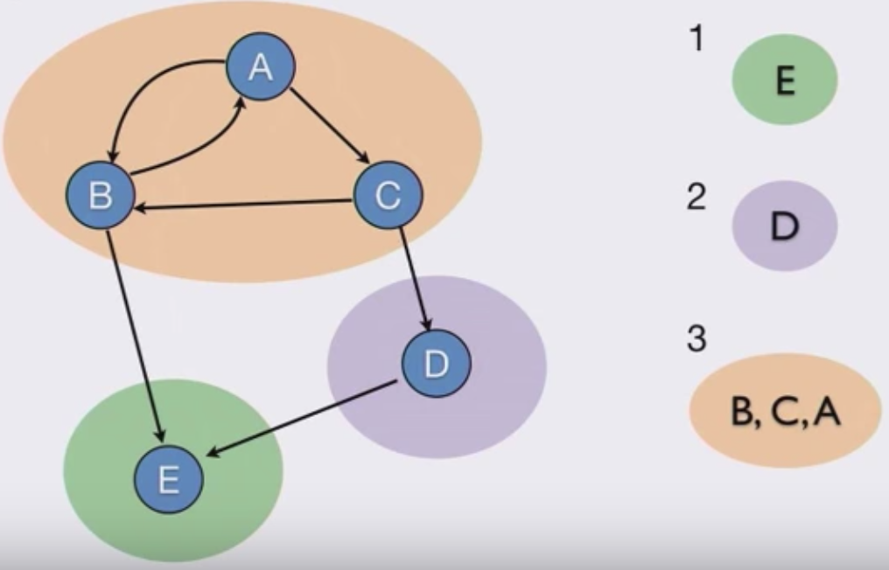

<iframe src="https://docs.google.com/presentation/d/e/2PACX-1vSgJTl82wQCe_sjea_QTPREjJZJ0IscEl9a41-cRlxOwa8ASqhB6Vohtm9SsLYF_eaLSjJeBVCZcFXS/embed?start=false&loop=false&delayms=3000" frameborder="0" width="480" height="299" allowfullscreen="true" mozallowfullscreen="true" webkitallowfullscreen="true"></iframe>

## Why Paxos?

Primary backup model does not work well when high availability is a concern. External failure detectors pick primary or backup replicas based on a timeout, but will be unavailable briefly when either goes down.

Paxos ensures high availability and also does not rely on any external failure detectors. External failure detector is also a single point of failure. 

## Why be Egalitarian?

Basic Paxos itself requires 2 RTT for each decision to be made, which is fairly costly, considering that we want to be supporting SMR most of the time. We want to lower the cost of consensus.

**Multi-Paxos** establishes a single replica as the cluster leader that has authority to directly commit to the transaction log. All clients connect to the leader to submit transactions to be replicated and ordered. However, this can be a bottleneck. Also, when leader election occurs, the system is not available. 

How can we achieve high availability (Paxos) with high throughput and low latency (Multi-Paxos)? How can we load balance across all replicas rather than being bottlenecked at the leader? 

### Slot contention 

A nice way to visualize what's going on in SMR is to understand the deterministic transaction log, where each transaction is a slot in a series of steps to be executed by the DSM. 

In **Basic Paxos**, each replica fights for each slot.

In **Multi-Paxos**, **Generalized Paxos**, and  **Fast Paxos**, one replica is elected as the leader and decides on who gets each slot, thereby deciding how transactions are totally ordered. 

In **Mencius Paxos**, each replica proceeds to append to the transaction log in round-robin fashion, thereby effectively load balancing. However, it will run at the speed of the slowest replica, since all replicas take turns at proposing. 

In **Egalitarian Paxos**, we remove the notion of slot contention, and make it such that each replica has its own row of slots, as in the image below. 

The red arrows represent constraints on the operations, which are explicitly defined. After committing at each replica, consensus is reached that `A <- B <- C <- D`

When an operation is proposed, the dependencies of that operation (as viewed from each replica) are OR'ed. So if `1` proposes to the network a new operation `B` that depends on nothing, but `2` knows about an operation `A` that was submitted earlier but not seen by `1` (hence the dependency on nothing), then `2` tells `1` that `B` depends on `A` UNION the empty set.

This process requires 2 RTT, which is where we started from. As an optimization, we only have to impose constraints on operations that are concurrent and interfering (e.g. operations on the same key). Otherwise, operations can be seen as non-interfering or non-concurrent, which can be correctly committed in only 1 RTT. Thankfully, in practice, concurrent and interfering operations are rare.

## Finding an order

Constraints can be drawn as a directed graph, and an order can be written by linearizing the graph's strongly connected components. When there are cycles, we execute operations in each strongly component by order of their sequence numbers e.g. approximating a Lamport Clock.

Note: similar concept to the universal tiebreaker in Lamport's Time, Clocks paper in establishing a total ordering of events in a distrubted system.

## References

1. [Achieving the Full Potential of State Machine Replication](https://www.youtube.com/watch?v=b8HgFVwmK6o)
2. [There is More Consensus in Egalitarian Parliaments](https://www.cs.cmu.edu/~dga/papers/epaxos-sosp2013.pdf)