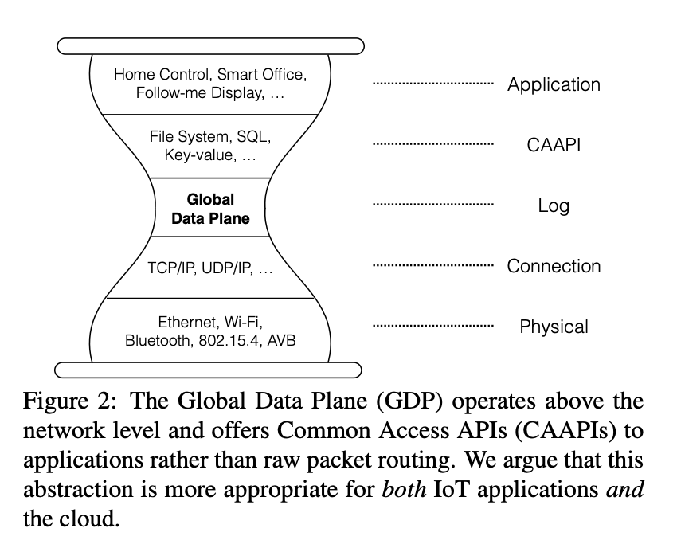

  Continuation from CS162 Sp19 special topics lecture, where I try to make sense of the big picture after reading a bunch of related papers.

## Current Architecture

Currently, it seems that all internet-connected devices and peripherals (even if they aren't "smart") talk to each other using web services that are hosted on the cloud. While this application architecture makes sense for a lot of use cases, you could certainly make the case that this is suboptimal for at least IoT. 

There are actually many issues, some which can be dealt with better than others on the cloud:

**Privacy & Security**

How do we ensure user privacy? IoT devices, peripherals, computers everywhere, etc. all collect data on individuals, and possibly upload to the cloud. Not only does this raise privacy concerns, but now also security concerns, as our personal information now hinges on the seucirty of the cloud. For example, if you have an IoT device that locks and unlocks your door based on a virtual switch in a mobile app, what happens when that data is released or stolen? Some bad things.

**Scalability**

While the cloud has traditionally been seen as scalable due to economies of scale, cloud scalability will inevitably reach its peak. Especially in consideration of some IoT workloads data must immediately be processed and discarded.

**Latency**

The cloud is also on the edge of the network. Even simple applications will face issues with latency from time to time. Going back to the example of being able to lock and unlock your front door at home: what are the consequences of not being able to lock your door in time or at all? What about the unbounded network latency? For the most part, the cloud serves its purpose well as an interconnect between smart devices, but that's not a property that will guarantee to hold in the context of latency.

Side note: I've recently spoken with a PhD working on "robotics as a service" systems that leverage the cloud's scalability. They mainly aim to offload ownership of models and compute to the cloud for higher efficiency, but have to sacrifice for internet-level unbound network latency. Meanwhile, issues such as privacy and security are pretty scary upon further investigation.

**Bandwidth**

The cloud being on the edge of the network means that IoT devices, which typically send and receive significant amounts of data to the cloud, will easily saturate various links' bandwidth in the network.

**Availability**

Typically it's OK if a web service has variable latency or intermittent loss of connection. However, depending on the workload and use case of certain IoT devices, this could be catastrophic. Internet connection can be spotty; that's a given. How do we design around that?

**Durability**

The cloud is out of the user's control, so there are no guarantees of data durability. Some data should be destroyed immediately after processing, while some data should never be lost. Durability guarantees are approximated by the cloud, but there are no granularity on the application level.

## Proposal

One proposal to address these issues of reliance on the Cloud and current concerns in internet architecture is the Global Data Plane (GDP). GDP focuses on transportation, replication, preservation, and maintaining the integrity of data. After all, a system with gaping security vulnerabilities (such as some current infrastructure) is fundamentally flawed. 

Some key features:

**Single-writer time-series logs**

Append only logs that are secured by public key cryptography. Like the bottom half of a blockchain.

Q: How is durability maintained? We can design a system to replicate data, but it's fundamentally distributed hardware system, and you're consuming others' resources, so how do you incentivize other nodes to store your data?

**Location-independent routing**

To embrace heterogeneous platforms and support a variety of storage policies, GDP uses location-independent routing using a network overlay designed on top of Chord DHT.

**Pub/sub and multicast tree**

Pubsub enables interactive applications. Effective bandwidth can be reduced by building multicast trees on top of the overlay network, for example when multiple subscribers exist.

**Common Acecss API**

The log abstraction is nice, and to extend its standard use further, common access APIs (CAAPIs) are developed to implement common higher-level structures such as key-value stores, filesystems, or databases. CAAPIs will need to handle log replay if services fail.

## Why

## References

1. [The Cloud is Not Enough: Saving IoT from the Cloud](https://www.usenix.org/system/files/conference/hotcloud15/hotcloud15-zhang.pdf)
2. [Secure Fog Robotics Using the Global Data Plane](https://swarmlab.berkeley.edu/sites/default/files/publications/fog_robotics_public_research_proposal_0.pdf)