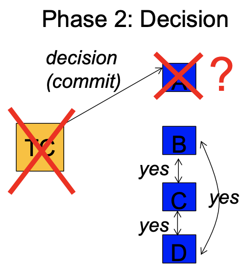

  Originally posted some time in the past when I just skimmed the paper. Editing for more structured notes in preliminary resesearch/design stage for consensus project.

## Motivation for 3PC and Paxos

On leader failure, 2PC fails safe, and execution of queries halt until the leader comes back online. 2PC is safe but not live. The goal with 3PC was to turn 2PC into a live (non-blocking) protocol: 3PC should never block on node failures as 2PC did. 

{: .center-image }

3PC in its most basic form does not block, and always makes progress by timing out. In the case of network partitions though, 3PC is unsafe and results in inconsistent states between replicas. 3PC is doomed for network partitions, and trades safety for liveness. In comparison, 2PC traded liveness for safety. 

In beginning to design a protocol that's both safe and live, the FLP impossibility result shows that it is impossible in the most general case. It's impossible for a set of processors in an asynchronous system to agree on a binary value, even if only a single process is subject to an unannounced failure. The root cause of the impossibility result is that in an asynchronous system, it is impossible to determine withether a machine has crashed or if a processor can't reach it now. Therefore, only for *synchronous* systems, 3PC can be made to guarantee both safety and liveness: knowing the upper bound of message delays, nodes can infer whether something has crashed. FLP doesn't say anything about how close a protocol can get to ideal safety and liveness though, which is where Paxos comes in.

Paxos is the most widely used consensus protocol, used in both industry and academia:
* Google: Chubby 
  * Paxos-based distributed lock service
  * Provides basic distributed filesystem, and naming
  * Used by GFS, Bigtable, and MapReduce to synchronize access to shared resources
* Yahoo: Apache Zookeeper
  * Paxos-based distributed lock service
  * Provides distributed configuration, synchronization, and naming
* UW: Scatter
  * Paxos-based consistent DHT 

Paxos ensures safety in that if agreement is reached, all nodes agree on the same value (which was proposed by some node in the past). To approximate liveness guarantee, nodes eventually in the case of node failure. And nodes may not always converge on a value, but this is only in degenerate cases which are improbable in real deployments. 

Paxos is similar to 2PC but with some key differences. In the basic algorithm, one or more nodes decide to be the *proposer*, and proposes values to *acceptors*, who then respond with their votes on the proposals. The proposer then announces the chosen value, or tries again if it's failed to converge on a value. Paxos deals with the challenges of having multiple proposers at once (e.g. network partitions), of proposers proposing different values than what has already been decided (e.g. transaction ordering), of crash faults, etc. This is possible because of Paxos' core differentiating mechanisms from 2PC: namely *egalitarian consensus*, *proposal ordering*, and *majority voting*.

In Paxos, no node is special, and any node can take over as coordinator at any time. If a coordinator fails, another one will time out and take over. This addresses the node failures (e.g. coordinator failures) of 2PC. Paxos also only requires $\frac{n}{2} + 1$ of the nodes for quorum, since two simultaneous majorities is impossible. This addresses the network partition issue of 3PC, since the network will not make progress if quorum is not reached. In recovering, proposal ordering is important for nodes to view consistent order of logical events/transactions.

## What's wrong with Paxos?

Comparison with Paxos' ubiquity in distributed systems prior to publication of Raft is important to understand Raft's niche and uses within the space. 

Paxos was originally published in a form known as *single-decree Paxos*, which could be chained in multiple instances to facilitate a series of decisions such as in a log with *multi-Paxos*. Paxos provably ensures both safety and liveness and surpports changes in cluster membership.

Paxos is however, traditionally considered very difficult to understand. Though the original paper is fun to read, it's often difficult to follow along with the logic and proof, though intuition makes sense.

In practice, single decree systems like Paxos do not translate well to the world of logs, especially since Paxos' method of chaining Paxos instances into Multi Paxos is somewhat hacky: choosing a collection of log entries independently and then merging them into a sequential log. It makes more intuitive sense (and performance-wise) to design a system around a log, rather than having the log be a byproduct or potential application of consensus on a singular value. 

Also, Paxos has weak leadership, and while this may be optimial if the main idea is distribution of responsibility, this inherent topological symmetry limits performance. Thust is another classic case of decentralization tradeoffs with performance. In a world where many decisions are being made simultaneously, it's simpler and faster to opt for stronger centralization: to first elect a leader and then have hte leader coordinate the decisions across the entire system.

So, there are often significant difference between the theoretical and purely algorithmic Paxos as described in the original *Part-time Parliament* paper, and real world practical implementations of it. 

## Notes on algorithm

* A node can be in 1 of 3 states
    - Follower (all start here)
    - Candidate
        - If followers don't hear from a leader (**Heartbeat**) then they can become a candidate
        - Request votes from other nodes
        - Can become the leader if gets majority vote, **Leader Election**
    - Leader
        - All changes in system go through leader

- **Log Replication**
    - Transaction made, log entry uncommitted at first
    - Leader sends to nodes, and then wait until majority have written entry
    - Leader then notifies followers that entry is committed
- **Leader Election**
    - 2 timeouts in regards to voting
        - **Election timeout**
            - Time follower waits until become candidate
            - Randomized between 150 and 300 ms
            - **Election Term** starts if dont see a leader
            - Node votes for self, and sends out *Request Vote*
            - Receiving nodes vote on candidate iff they haven't voted yet this term
            - Election timeout reset
        - Leader sends out *Append Entries*, with intervals specified by **Heartbeat Timeout**
            - Followers respond to *Append Entries* message
            - Election term will continue until a follower stops receiving heartbeats and becomes a candidate
        - Requiring majority votes guarantees only one leader can be elected per term
        - Unless **split vote**
            - Two nodes both start an election for the same term
                - Not enough
                - Wait for election and try again next term
        - **Log Replication** procedure
            - Once have leader, replicate all changes to all nodes
            - Uses same *Append Entries* message
            - Client sends leader request, appends to leader log
            - Leader sends to all other nodes on next heartbeat
        - **Partition Tolerance**
            - Uncommitted so long as no majority
            - Majority as seen in face of partition, eg 2+3 partition, 3 can 2/3 majority
            - Recovery
                - Leader step down when higher term seen
                - Roll back uncommitted entries and match new leader's log

## References

1. [In Search of an Understandable Consensus ALgorithm (Extended Version)](https://raft.github.io/raft.pdf)
2. [Agreement in Distributed Systems: Three-phase Commit, Paxos](https://roxanageambasu.github.io/ds-class//assets/lectures/lecture17.pdf)
3. [Raft.js: Raft Consensus Algorithm in JavaScript](https://github.com/kanaka/raft.js)
4. [Scalable Consistency in Scatter](https://homes.cs.washington.edu/~tom/pubs/scatter.pdf)
5. testing from stackedit
<!--stackedit_data:
eyJoaXN0b3J5IjpbLTQ1Mjg2MTA0Ml19
-->