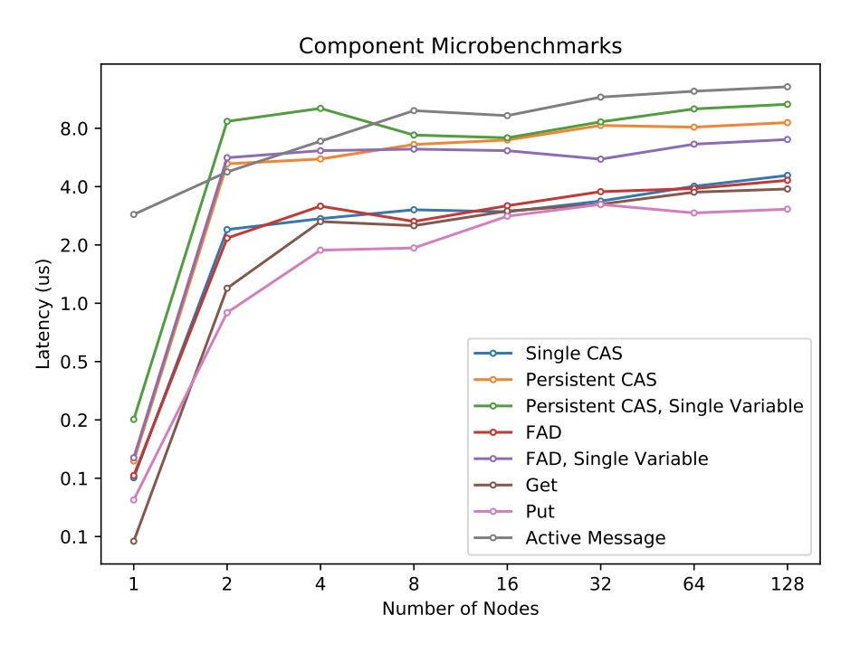
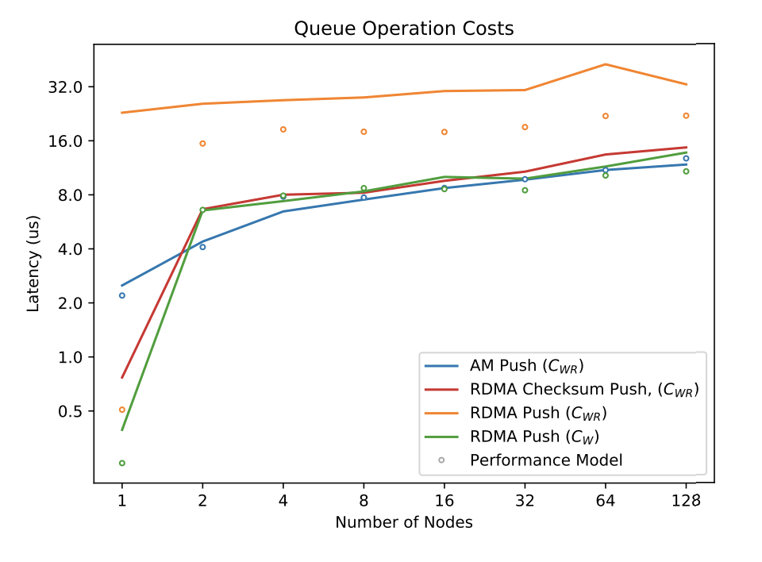
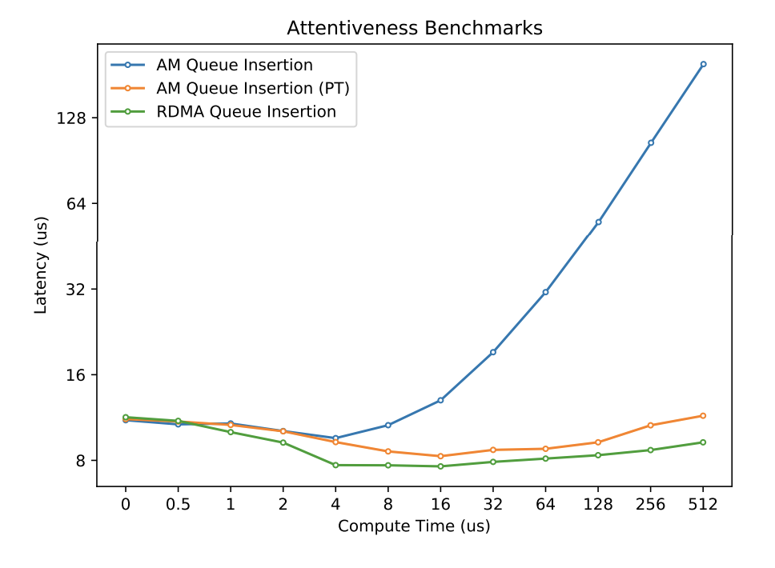

Both RDMA and RPC have pros and cons, and we need to identify which exact circumstances the benefits of heavy vs light data/communication is beneficial. 

Audience:
* Network architects to improve networks for distributed data structures
* Devs to design better data structures for current networks

Strategy: 
* Measure microbenchmarks at level below both RDMA and RPC abstractions, such as cost of RPC and one-sided memory operation
* Measure cost of actual data structure operations at varying levels of atomicity. 

## RDMA

* Don't require remote cpu
* Low latency
* Increasing support via Cray Aries, Infiniband, and RDMA over converged Ethernet (RoCE)
* Operations considered
  * rput
  * rget
  * compare-and-swap
  * fetch-and-op
* Natural support with PGAS (e.g. BCL and DASH)
  * Similar to shared memory concurrent data structures: atomic memory operations (AMOs) for sync
  * Different costs and sync models needed

Hash table insert example:
* Naive insert considers cost of CAS and cost of write as $A_{CAS} + W$
* Not fully atomic since someone can read a half-written value by rput
* For full atomicity, include var to mark slot OK for read $2A_{CAS} + W$
  
Liveness guaranteed by the NIC. 

## RPC 

* Require attention of remote CPU
* Higher latency
* More expressive than current RDMA, leading to fewer round trips potentially
  * **OBSERVATION**: Number of network operations is unrelated to the control flow logic inside application functions
* Paper considers active message (restricted type of RPC)
  * functions called with AM may not require network communication
  * may not send additional AM except as response

Generally(?) will consist of two main parts
1. Handler function that will be executed on the target process
2. Wrapper function that will issue an RPC request from the origin process

Liveness depends on target process having entered progress function in order for RPC queue to be serviced. Should either have a progress thread or pay liveness cost 

## Benchmarking

One-sided memory access-based implementations of distributed data structures vs RPC-based implementations.

BCL distributed data structures

GASNet active messages

### Component Observations

* Put fastest
* Get, FAD, Single CAS next 
* Persistent CAS more expensive than Single CAS since need multiple round-trips to succeed in swapping target value
* Single FAD more expensive than FAD, due to strange transient issue only on Cori (with Cray Aries NIC)
  * Surprising because NIC-accelerated FADs not supposed to be affected by choice of target address 
  * Should only happen at lower level and also in shared memory environment (e.g. directory or snooping protocol for cache coherence)

{: .center-image}

### Queue Observations

* Consistent with Single FAD
* RDMA Push $C_{WR}$ has performance hit during second AMO, which needs more round trip attempts than Persistent CAS benchmark would suggest 
  * Multiplier on this for number of attempts
  * Due to inherent serialization since Push can only go through after all other insertions have finished writing, via advancing `tail_ready` pointer

{: .center-image}

### Attentiveness Observations

* Only considered perfect active message attentiveness (e.g. progress thread)
* AM faster than RDMA until computation time exceeded 2 microseconds
  * Question: relation between expressivity and computation time? 
* RDMA latency goes down as computation time increases, since quieter network spaced across more computation

{: .center-image }

## Thoughts

This is somewhat like recursive vs iterative lookups (e.g. for DNS) from the perspective of the client. Recursive lookups are a single round trip for a client, who issues the first request which then gets propagated by other components which are "smart". Iterative lookups require potentially many more round trips for the client, but each component that receives the request can be "dumb" and only support messages signaling having data, not having data, or knowing a hint as to where the data might be. 

Recursive lookups are more expressive

Iterative is cheaper in the best case, and also may allow for higher levels of parallelism

1. [RDMA vs. RPC for Implementing Distributed Data Structures](https://people.eecs.berkeley.edu/~brock/papers/am_rdma_data_structures.pdf)