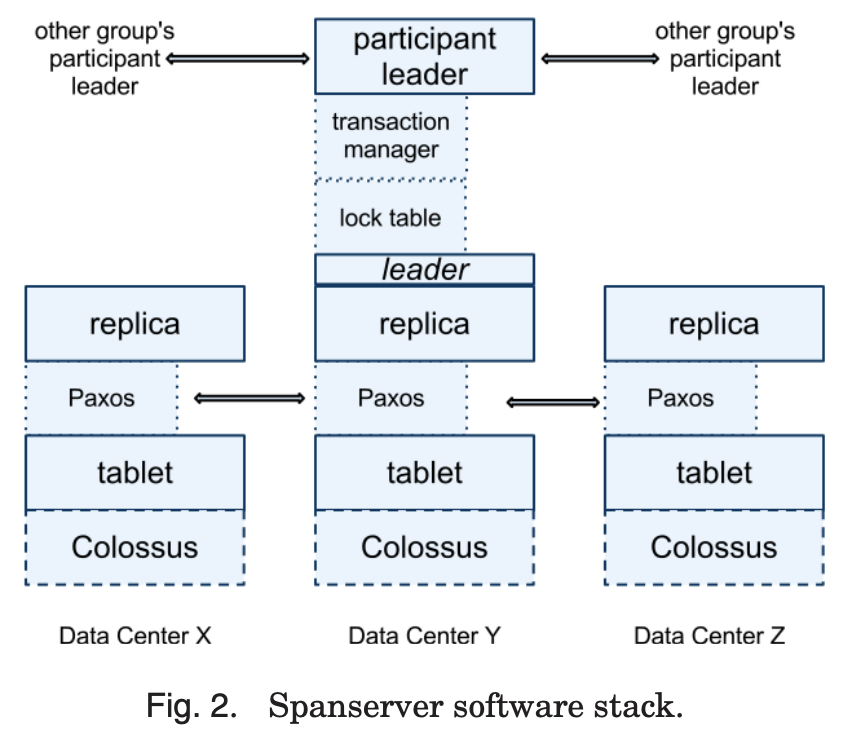

## Notes

Spanner is a large distributed relational database deployed within Google. Spanner is able to make good performance vs consistency tradeoffs by considering uncertainty and its necessity in determining correctness. This is done by creating an API that directly exposes clock uncertainty: Spanner calls this the TrueTime API.

## Spec

* **Universe** is a Spanner deployment, which is split into a set of **zones**
* **Zones** are units of administrative deployment e.g. servers or datacenters. The represent geographic distance
* Zones controlled by one **zonemaster**, which orchestrates and assigns data to **spanservers**, which serve their assigned data

### Spanserver

Spanservers support many **tablet** data structures, each of which contains a mapping of a key and timestamp to a string. Timestamp is important and makes Spanner more like a multiversion database than a key value store like Bigtable.

Tablets are used in the Colossus distributed filesystem. Each tablet (bag of mappings) is replicated using its own Paxos state machine. Writes initiate the Paxos protocol at the leader, and reads access state directly from the underlying tablet at any replica that is sufficiently up to date(?) 

To imporove Spanner's throughput in presense of WAN latencies, Paxos in Spanner is pipelined, following Lamport's "multi-decree parliament". 

Spanservers that are the leader of their Paxos group are required to implement a lock table for concurrency control. For this reason, it's important to have a long-lived leader. Also, Spanner was designed with long-lived transactions in mind. The lock table lives only in the leader and is not replicated by Paxos, given how volatile it is.

Spanservers that are the leader of their Paxos group are also required to implement a transaction manager to support distriuted transactions between Paxos groups. Transaction manager can be bypassed if transactions only involve one Paxos group. But if multiple Paxos groups are required, thenthe groups' leaders coordinate with a 2PC. The transaction manager is replicated by the underlying Paxos group.

## References

1. [Spanner: Google's Globally Distributed Database](https://storage.googleapis.com/pub-tools-public-publication-data/pdf/65b514eda12d025585183a641b5a9e096a3c4be5.pdf)
2. [The Part-Time Parliament](https://lamport.azurewebsites.net/pubs/lamport-paxos.pdf)