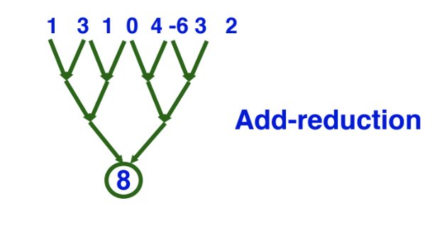

  Blew my mind when I heard that you can do matrix multiply in log time (if you have a cubic number of processors). Sure, makes sense, but I've never really thought about it like that. Data parallelism is beautiful! Notes from CS267 graduate level parallel computing course, lecture 6.

## Basics

* **Unary operators**: applied to all elements of an array
* **Binary operators**: applied to all pairs of elements
* **Broadcast**: fill a value into all elements of an array
  * Useful for $a*X+Y$ e.g. axpy
* **Reduce**: reduce array to value with any associative operation e.g. addition
  * Associativity so we can perform ops in any order
* **Scan**: fill array with partial reductions any associative op e.g. sum scan, max scan
* **Mask**: ability to apply operations under binary mask e.g. $A = A + B \text{ under } M$

## Cost models

Usually, in order to discover inherent parallelism, it's useful to consider a machine that has an unbounded number of processors, and that is capable of free control overhead and communication. Inherent parallelism as defined above loosely defines an algorithm's span, and serves as a theoretical lower bound on all real machines.

Span for unary or binary operations are $O(1)$ since there are unbounded number of processors, Span for reductions and broadcasts are cost $O(log(n))$ using a tree of processors.

You can multiply matrices of dimension order $n$ in $O(log(n))$ time if you use $n^3$ processors, each which does constant work, then reducing with tree structure:
1. For all $1 \leq i, i, k \leq n$, let $P(i,j,k) = A(i,k) * B(k,j)$
2. For all $1 \leq i, j \leq n$, let $C(i,j) = \sum_{k=1}^n P(i,j,k)$

Not realistic, but fun! 

